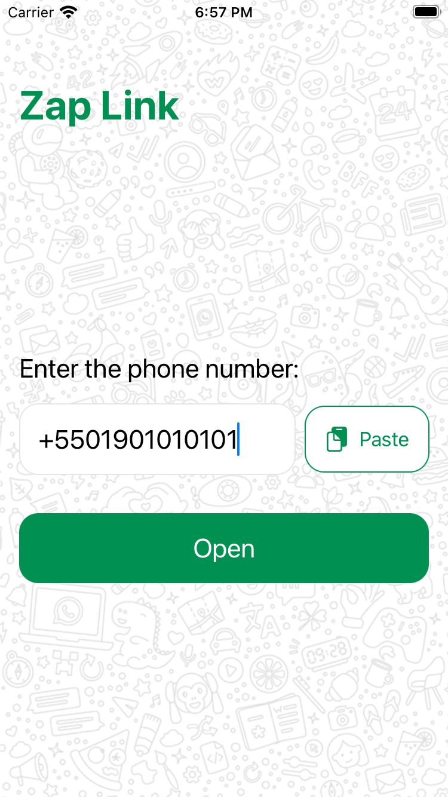
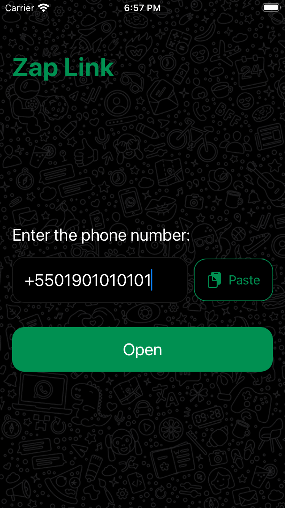

# ZapLink

     

> Native iOS app built with SwiftUI + TCA to open a WhatsApp chat from a phone number without saving the contact first.
>
> Designed for one-time conversations (customers, deliveries, support, temporary contacts) with a fast, minimal flow.

## Highlights

- SwiftUI app architecture with The Composable Architecture (TCA)
- Fast paste flow with clipboard detection/import
- Phone number sanitization and WhatsApp deep link generation (`wa.me`)
- Light and dark mode support
- Localization support with `Localizable.xcstrings` (`pt-BR` and `en`)
- Unit-tested feature logic and parsing behavior (98% coverage)

## 📱 Screenshots

| Light Mode | Dark Mode |
| --- | --- |
|  |  |
| Enter or paste a number and open WhatsApp instantly | Same fast flow with dark mode support |

## 👩🏾‍💻 Tech Stack

- SwiftUI
- TCA (The Composable Architecture)
- XCTest + TCA `TestStore`
- Swift Package Manager (SPM)

## ✅ Testing Strategy

- Reducer tests for `PhoneFeature` state transitions and actions using TCA `TestStore`
- Dependency injection/mocking for `openURL` and pasteboard behaviors
- Parser tests for phone number extraction, sanitization, and WhatsApp URL generation
- Regression coverage for formatted inputs (spaces, symbols, country code handling)

Tests are located in `ZapLinkTests/Features/Phone`.

## 🚀 Setup / Run / Test

### Requirements

- Xcode (version with iOS 16.6+ SDK support)
- iOS Simulator or physical iPhone

### Setup

```bash
git clone https://github.com/marcos1262/zap-link.git
cd zap-link
open ZapLink.xcodeproj
```

Xcode resolves Swift Package Manager dependencies automatically on first open.

### Run

1. Select the `ZapLink` scheme
2. Choose an iPhone simulator (or device)
3. Press `Run` in Xcode

### Test

Run all tests in Xcode (`Cmd+U`) or use:

```bash
xcodebuild test \
  -project ZapLink.xcodeproj \
  -scheme ZapLink \
  -destination 'platform=iOS Simulator,name=iPhone 16'
```

If your simulator name differs, replace `iPhone 16` with any available iPhone simulator.
